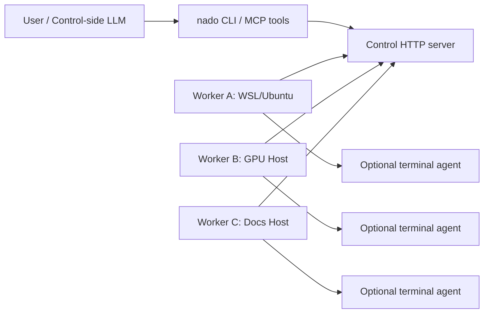

# Nado Agent MVP Design

## Goal

Build a directly usable gateway MVP for a multi-device agent system:

- One control side can discover and communicate with many worker machines.
- Worker machines can be Ubuntu, WSL, or similar hosts with shell tools and optional terminal LLM agents.
- The user only interacts with the control side.
- Tasks can be assigned explicitly to a worker or routed by capability such as `gpu`, `code`, `docs`, or `ppt`, plus worker labels such as `zone=lab` or `role=builder`.
- The control-side LLM agent can know which workers exist, supervise their work state, manage worker lifecycle, and dispatch tasks through tools.

## Architecture

Nado uses a simple control-plane topology:

Workers make outbound HTTP calls to the control server. This keeps the MVP easy to run across WSL, LAN machines, and hosts behind common firewall setups.

The gateway owns worker supervision. Each worker has:

- `adminState`: control-side desired state, such as `enabled`, `paused`, `draining`, or `shutdown_requested`.
- `observedState`: worker-reported state, such as `idle`, `running`, `paused`, or `draining`.
- `gatewayState`: control-side computed state, such as `idle`, `running`, `paused`, `drained`, `draining_running`, `shutdown_requested`, or `offline`.
- `currentTaskId`: the task currently being executed, if any.
- `currentTaskIds`: all tasks currently being executed when the worker has more than one execution slot.
- `maxConcurrency`: the number of independent tasks the worker is willing to run at once.
- `metrics`: host/runtime information reported by worker heartbeat.
- `inventory`: host/tool discovery including runtime, Git, GitHub CLI, Codex CLI, Claude CLI, and GPU probes.
- `commands`: queued management commands sent by the gateway and acknowledged by the worker.

The gateway also owns sessions. A session is a long-lived subproject context:

- Multiple tasks can reference the same `sessionId`.
- The first claimed task assigns the session to a compatible worker.
- Later tasks in the session are routed back to that same worker.
- Session tasks reuse `.nado/workers/<worker-id>/sessions/<session-id>` on the worker.
- Session artifacts are still uploaded per task to the control side.
- Agent tasks in a session maintain `.nado-session/transcript.md`; later agent prompts include the prior transcript so stateless terminal-agent commands receive continuity.

The gateway also owns batches. A batch is a durable group of independent or dependency-ordered tasks:

- A batch has a stable `batchId`, title, task IDs, events, and derived aggregate status.
- Batch tasks are ordinary tasks with `batchId`, so scheduling, capacity, artifacts, recovery, and inspection use the same task model.
- Control-side agents can submit multiple subtasks at once, then inspect or wait on the batch as a unit.
- Batch tasks can declare a stable `key` and `dependsOn` keys. Dependent tasks stay `blocked` until all parent tasks succeed, then re-enter the same queued task path.
- Dependent batch tasks can opt in to receiving direct parent artifacts as input files under `.nado/dependencies/<parent-key>/`.
- Failed or cancelled dependencies keep downstream tasks blocked with a visible reason; retrying the failed parent can unblock the downstream tasks when the parent later succeeds.
- Failed or cancelled child tasks can be retried without recreating the batch or rerunning successful child tasks.
- Non-terminal child tasks can be cancelled as a batch, using the same task cancellation and worker command path as individual task cancellation.

## Technical Baseline

The MVP and later versions use the same technical scheme:

- Runtime: Node.js 20+ with no mandatory external runtime dependencies for the core control/worker path.
- Protocol: HTTP JSON API between CLI, control server, and workers.
- Worker connectivity: workers make outbound register, heartbeat, claim, event, and result calls to the control server.
- Network addressing: control and worker URLs use normal HTTP URL syntax, including bracketed IPv6 literals such as `http://[::1]:8765`; CLI-generated local URLs are formatted through the shared URL helper instead of string-concatenating raw hosts. In the Docker demo, `NADO_HOST` controls the control process listener inside the container, while `NADO_DOCKER_HOST_IP` controls the host-side published port binding.
- Gateway management: workers receive management commands through heartbeat responses, so workers do not need inbound ports.
- Worker inventory: workers self-report tools and inferred capabilities; manual capabilities remain supported and are merged. Resource diagnostics distinguish probe-detected GPU workers from advertised-only GPU capability so operators and control-side agents can see when a demo/manual label lacks an NVIDIA/ROCm runtime probe. GPU-required tasks prefer probe-detected GPU workers when available, while advertised-only GPU workers remain eligible as a fallback. Readiness diagnostics distinguish real Codex/Claude terminal agents from custom commands, demo echo agents, missing CLI tools, failed self-tests, and shell-only workers. Agent-task scheduling uses these diagnostics to prefer real terminal agents over demo echo agents and to reject Codex/Claude preset workers when the matching CLI is missing.
- Capability inference: explicit capabilities remain the strongest signal, and the scheduler can also infer GPU, docs, and PPT needs from high-confidence task text such as CUDA/NVIDIA/VRAM/显存, README/documentation/文档, or PPT/PowerPoint/幻灯片/演示文稿 wording.
- Worker capacity: workers self-report `maxConcurrency` and current running task IDs; tasks can reserve one or more slots, and the control server enforces weighted capacity during scheduling and claims.
- Task model: the `Task` record, worker capability matching, lifecycle events, task workspace, cancellation, and result schema are the stable product contract.
- Task attempts: each worker claim creates a distinct attempt ID; worker events and results must match the current attempt so stale results from superseded offline workers cannot overwrite recovered work.
- Worker label routing: tasks and sessions can require worker labels without bypassing the normal scheduler or claim path.
- Task priority: queued tasks keep a numeric priority so urgent control-side work can be claimed before older lower-priority work.
- Batch model: the `Batch` record groups independent or dependency-ordered tasks without creating a separate execution path.
- Scheduler: unassigned tasks are bound by the control server at creation time using the same worker/task/session/capacity state exposed through the API.
- Input files: tasks can carry bounded control-side files or directories that workers materialize into the task/session workspace before execution.
- Routability guard: task and batch submissions can ask the gateway to reject work before creation when no online/admin-enabled worker matches static routing constraints.
- Task env: tasks can carry explicit environment variables for build flags and tool configuration; reserved `NADO_*` values are always supplied by the worker after custom env.
- Session model: the `Session` record, worker affinity, shared workspace, task history, and close behavior are stable product contracts.
- CLI and MCP: `src/cli.js` and `src/mcp-server.js` are the primary user and control-agent interfaces, not throwaway demo wrappers.
- Dashboard: the control server serves a lightweight browser dashboard from the same HTTP API for agent-style Control Console submission with automatic task detail/event streaming, operator inspection, worker detail/inventory/metrics review, AGENTS.md context preview/download, gateway manifest preview/download, MCP client config generation, doctor checks, readiness verification, self-service worker bootstrap bundle download, fixed-ID worker invite and portable worker bundle download/self-test/token management, shell/agent task submission with env/input files/artifact policy/workspace controls/routability guards, scheduler inspection, task event streaming, task management, offline task recovery, session creation/inspection, session task submission, latest session artifact download, batch planning, dispatch preview, batch submission, batch management, batch event timeline inspection/streaming, batch artifact download, and batch report inspection.
- Storage: the control server uses a durable store abstraction with the same task/worker/session/batch contract across backends. `JsonStore` remains the local/dev default, while `SQLiteStore` is the production-shaped single-VM backend selected with `NADO_STORE=sqlite`.
- Execution: shell and configurable terminal-agent task types are the durable worker execution abstraction. Later container or VM sandboxes should wrap this execution layer rather than replace the control protocol.
- Sandbox profile: `sandboxProfile: "isolated"` runs through the same worker execution path with a minimal inherited host environment, explicit task env, and gateway-managed `NADO_*` variables. This reduces accidental worker environment leakage while leaving stronger OS/container isolation as a wrapper around the execution layer.
- Agent continuity: session agent tasks persist and reuse a gateway-owned transcript in the session workspace, independent of any specific agent vendor.
- Auth: the shared bearer token remains the admin control credential; issued worker tokens are durable, revocable credentials bound to one worker ID and limited to the worker execution path. Self-service enrolled worker tokens also store the worker public key and require Ed25519-signed worker requests after enrollment. Signed worker requests include a timestamp, body hash, and nonce; the gateway rejects replayed nonces inside the timestamp window.

This means the MVP is a vertical slice of the intended product, not a temporary prototype. Future work should extend the same control API, worker polling model, CLI commands, and task schema.

## Components

### Control Server

Responsibilities:

- Accept worker registration and heartbeat events.
- Store worker metadata, capabilities, durable runtime events, and last-seen timestamps.
- Accept task submissions.
- Accept batch submissions and create grouped child tasks.
- Accept session creation and close requests.
- Route tasks by explicit worker ID, required capabilities, or required worker labels.
- Schedule unassigned tasks by filtering offline/paused/draining/capability-incompatible/tool-incompatible/label-incompatible/full workers and scoring available capacity, idle state, tools, explicit or inferred capability matches, agent availability, and recent failures.
- Enforce worker label requirements during scheduling and again during worker claim.
- Route session tasks back to the session-assigned worker.
- Serialize tasks within one session while allowing independent tasks to run concurrently on workers with free slots.
- Let workers claim one compatible queued task at a time.
- Assign each claim a task attempt ID and ignore stale events/results from older attempts.
- Prefer higher-priority queued tasks during worker claim while preserving FIFO order for equal priorities.
- Store task events, stdout/stderr excerpts, exit codes, and final status.
- Store live stdout/stderr events while tasks are still running.
- Store task artifacts uploaded by workers so outputs generated on remote machines are available from the control side.
- Support task-level management for cancellation and requeue/retry.
- Recover tasks stranded on offline workers by listing stale running tasks and requeueing them to another worker or back through the scheduler.
- Track worker admin state, observed state, current task, metrics, offline status, and management commands.
- Provide APIs consumed by the CLI and MCP tools.
- Serve a browser dashboard at `/` and `/dashboard` that uses the same authenticated HTTP APIs.

### Dashboard

Responsibilities:

- Let an operator paste the admin token in the browser without changing the HTTP API authentication model.
- Show one refreshed gateway snapshot with workers, task counts, batches, sessions, slots, capabilities, labels, tools, and current task state.
- Preview and download a machine-readable gateway capabilities manifest through the same authenticated HTTP API. The manifest includes networking conventions for IPv6/public control URLs and a routing-policy summary so control-side agents can reason about automatic GPU/docs/PPT inference and scheduler explainability before dispatching work.
- Run readiness verification through the same authenticated `POST /api/verify` path used by HTTP clients and control-side agents.
- Preview dispatch for editable batch JSON through the same dry-run scheduler API used by CLI and MCP.
- Require static routability on task and batch submissions before mutating gateway state.
- Download self-service worker bootstrap bundles for hosts that should generate their own identity, then issue worker-specific tokens and generate fixed-ID bash or PowerShell worker invite scripts and portable bundle downloads through the same onboarding contract used by the CLI, HTTP API, and MCP.
- List and revoke worker-specific tokens through the existing worker-token APIs.
- Submit shell or terminal-agent tasks through the existing `POST /api/tasks` path.
- Cancel, requeue, and reschedule tasks through the existing task management API.
- Create, inspect, and close sessions through the existing session APIs.
- Submit tasks into existing sessions so session work can reuse the same worker workspace and agent transcript.
- Submit batch JSON through the existing `POST /api/batches` path.
- Inspect batch child tasks, aggregate reports, and merged event timelines through existing batch detail, report, event, and event stream APIs.
- Retry failed/cancelled batch children and cancel remaining batch work through the existing batch management API.
- Inspect task detail through existing task/artifact APIs, including scheduler decisions, stdout, stderr, events, live event streams, and downloadable artifacts.
- Send worker management actions through the existing worker management API.
- Avoid a separate frontend service or build step; the dashboard is part of the control server runtime.

### Worker Client

Responsibilities:

- Register with the control server.
- Advertise manually configured capabilities, labels, and automatically discovered inventory.
- Advertise `maxConcurrency` and currently running task IDs.
- Poll for queued work.
- Keep heartbeats running while work is executing.
- Apply management commands: pause, resume, drain, shutdown, and cancel current task.
- Execute each task inside a per-task workspace.
- Execute session tasks inside a shared per-session workspace.
- Materialize task input files before command or agent execution.
- Inject task environment variables before reserved gateway `NADO_*` variables.
- For session agent tasks, write an augmented prompt file containing the prior agent transcript and current task prompt.
- Scan completed task workspaces and upload bounded-size artifacts to the control server, filtered by task artifact include/exclude policy when provided.
- Optionally clean non-session task workspaces after artifact upload; session workspaces are preserved for multi-step continuity.
- Support shell tasks and configurable terminal-agent tasks.
- Report lifecycle events and final results.
- Stream stdout/stderr chunks back to the gateway as task events while a command is running.
- Run multiple independent tasks concurrently up to weighted `maxConcurrency` slots; session tasks remain serialized by the control server.

### CLI

Responsibilities:

- Start control and worker processes.
- Generate self-service worker bootstrap bundles so remote Ubuntu/WSL or PowerShell hosts can generate a local keypair, enroll with a public key, receive a worker-scoped token, and store their assigned worker ID locally before using the same signed worker start contract.
- Generate fixed-ID worker invite scripts or portable worker bundle zips from CLI, HTTP, or Dashboard containing the actual worker runtime and start scripts when the operator needs to choose the worker ID up front.
- Run worker preflight from invite scripts or manually to validate local runtime, data directory, control health, and token binding before starting a long-running worker.
- Record and expose worker runtime events so operators and control-side agents can diagnose remote hosts without first logging into those hosts.
- Issue, list, and revoke worker-specific tokens for safer remote host onboarding.
- List workers and tasks.
- Show gateway status and run doctor checks, including an optional end-to-end worker self-test task.
- Run end-to-end readiness verification for operators and scripts using the same API paths exposed to custom clients.
- Submit shell or agent tasks.
- Submit a task, wait for terminal status, and download artifacts in one operator flow.
- Draft submit-ready batch JSON from short subtask lines, then submit it through the same batch API.
- Submit tasks with explicit required tools such as `node`, `git`, `gh`, `codex`, `claude`, or `nvidia-smi`.
- Submit tasks or sessions with worker label requirements.
- Submit tasks with priority for queue ordering.
- Submit a JSON batch of independent or dependency-ordered tasks and inspect aggregate status.
- Let dependent batch children consume parent artifacts without requiring worker-local shared storage.
- Apply top-level batch defaults so common routing, artifact collection, and runtime policy does not need to be repeated on every child task.
- Attach control-side files or directories to individual batch child tasks through the same input file payload used by normal task submission.
- Inspect or watch a merged batch event timeline across all child tasks.
- Retry only failed/cancelled child tasks in a batch.
- Cancel all non-terminal child tasks in a batch.
- Download all child task artifacts from a batch into per-child output directories.
- Submit a batch, wait for terminal status, print the consolidated report, and download grouped artifacts in one operator flow.
- Attach input files or directories to submitted tasks.
- Manage workers.
- Create, list, inspect, and close sessions.
- Inspect a task in detail.
- Inspect the scheduler decision recorded on a task.
- Wait for a task to finish, optionally printing newly observed events while waiting.
- Inspect live task events.
- Cancel or requeue tasks, optionally targeting a new worker.
- List and recover running tasks stranded on offline workers.
- List and download artifacts from completed remote tasks.
- Generate and serve an agent context file so Codex, Claude Code, or another control-side agent can see available workers and dispatch examples from CLI, HTTP, or Dashboard.
- Generate a reusable stdio MCP client config from CLI, HTTP, or Dashboard for attaching a control-side agent to the gateway.
- Verify gateway readiness from CLI, HTTP, MCP, or Dashboard before assigning real work.
- Preview worker assignment for task lists or batch JSON before mutating gateway state.
- Require static routability during task or batch submission when the caller wants a hard preflight gate.

### MCP Server

Responsibilities:

- Expose gateway state and management as structured tools to control-side agents.
- Let agents list workers, list tasks, submit tasks, inspect tasks, list task events, wait for task completion, and manage workers.
- Let agents submit one task, wait for terminal status, and retrieve artifact content in one tool call when a handoff should be synchronous from the agent's perspective.
- Let agents submit tasks and sessions with worker label requirements.
- Let agents generate self-service worker bootstrap bundles for remote host onboarding without first asking the user for a worker ID.
- Let agents generate fixed-ID worker invite scripts and worker bundle zips as base64 content for remote onboarding when a preselected worker ID is required.
- Let agents inspect worker preflight and worker runtime events through MCP tools.
- Let agents issue invite scripts that embed a revocable worker token rather than the shared admin token.
- Let agents list and revoke worker-specific tokens.
- Let agents submit and inspect durable task batches.
- Let agents submit a batch, wait for terminal aggregate status, inspect a consolidated report, and retrieve grouped artifact content in one tool call when multi-task handoff should be synchronous from the agent's perspective.
- Let agents wait for batch completion and list all child task artifact metadata.
- Let agents inspect a merged batch event timeline across batch and child task events.
- Let agents retry failed/cancelled batch child tasks or cancel remaining batch work.
- Let agents recover tasks stranded on offline workers.
- Let agents inspect scheduler decisions before explaining or adjusting dispatch.
- Let agents run end-to-end readiness verification before assigning or escalating work.
- Let agents preview multi-task dispatch plans using the same scheduler and capacity model as real task creation.
- Let agents request routability-guarded submission so impossible work is rejected before task records are created.
- Let agents create/list/inspect/close sessions, submit tasks into a session, and fetch the latest session artifact snapshot.
- Let agents list and fetch artifacts produced by remote workers.
- Use the same HTTP API, task model, and management model as the CLI.

## Task Types

### `shell`

Runs a command in the task workspace using the host shell:

- Linux/macOS: `/bin/bash -lc`
- Windows: PowerShell

### `agent`

Runs the worker's configured `--agent-command` template. Supported placeholders:

- `{prompt}`: inline prompt text with simple shell escaping
- `{promptFile}`: path to a file containing the prompt
- `{workspace}`: task workspace path

This lets each worker use Codex, Claude Code, GitHub Copilot CLI, or any similar local terminal agent without hard-coding one provider.
Operators can use `--agent <preset>` for built-in command templates such as `codex` and `claude`; the preset resolves to the same stored agent command field and does not introduce a separate execution path.

## Task Environment

Worker child processes receive stable environment variables:

- `NADO_TASK_ID`
- `NADO_BATCH_ID`
- `NADO_BATCH_KEY`
- `NADO_BATCH_DEPENDS_ON`
- `NADO_SESSION_ID`
- `NADO_WORKER_ID`
- `NADO_WORKSPACE`
- `NADO_AGENT_TRANSCRIPT`
- `NADO_HOSTNAME`

Custom task `env` values are also available to the child process. Reserved `NADO_*` names are controlled by the worker runtime and override any custom task env values with the same names.

## Security Model

The MVP is an orchestration layer, not a hardened isolation boundary.

Controls included:

- Shared bearer token for all API calls.
- Worker-specific bearer tokens can be issued by the control side, are stored only as hashes, are bound to one worker ID, and can be revoked.
- Worker tokens are restricted to registering their bound worker, heartbeating, claiming tasks, acknowledging worker commands, streaming task events, and reporting task results for tasks assigned to that worker.
- Self-service worker tokens with registered public keys must sign worker requests, and replayed signed nonces are rejected.
- Per-task workspaces under the worker data directory.
- Task timeout and max-output capture.
- No inbound ports needed on workers.

Limitations:

- Shell and agent tasks execute with the worker user's OS permissions.
- Strong sandboxing should be added with containers, firejail, restricted users, or VM boundaries for untrusted tasks.
- TLS should be terminated by a reverse proxy or tunnel for remote networks.
- The admin token remains powerful and should not be copied to remote workers once worker-specific invite tokens are being used.

## Data Layout

Default state lives under `.nado` in the current working directory:

- `.nado/control-state.json`: JSON control-side workers/tasks for local/dev runs.
- `.nado/control-state.sqlite`: SQLite control-side workers/tasks for VM deployments.
- `.nado/artifacts/<task-id>`: control-side copies of artifacts uploaded by workers.
- `.nado/workers/<worker-id>/tasks/<task-id>`: worker task workspaces.
- `.nado/workers/<worker-id>/sessions/<session-id>`: worker session workspace shared by multiple tasks.
- `.nado/AGENTS.md`: generated control-side context file.

## MVP Work Items

1. Project design and acceptance docs.
2. Control server API and persistent JSON store.
3. Worker registration, polling, execution, and reporting.
4. Gateway supervision: heartbeat metrics, admin state, observed state, gateway state, current task, and offline detection.
5. Gateway management: pause, resume, drain, shutdown, and cancel-current commands.
6. CLI for starting nodes, discovering workers, managing workers, submitting tasks, and inspecting results.
7. MCP tools for control-side agents.
8. Agent context generation and safe installation into project `AGENTS.md` files.
9. Artifact collection and download so remote worker outputs are available on the control side.
10. Sessions for multi-step subprojects with worker affinity and shared workspace.
11. Live stdout/stderr task events for long-running task supervision.
12. Input file and directory delivery from control side to worker workspaces.
13. Batch artifact download for recovering remote workspace outputs on the control side.
14. Task-level fault recovery with cancel and requeue.
15. Agent session transcript for multi-turn terminal-agent continuity.
16. Worker self-discovery for tool inventory and inferred capabilities.
17. Control-side scheduler that binds unassigned tasks to the best eligible worker and records an explainable decision.
18. Per-worker weighted concurrency capacity with bounded parallel execution and capacity-aware scheduling.
19. Offline worker recovery for tasks stranded in `running` state after heartbeat loss.
20. Durable task batches for submitting multiple independent subtasks as one unit.
21. Batch retry for requeueing only failed/cancelled child tasks.
22. Batch dependencies for keeping child tasks blocked until parent tasks succeed.
23. Worker invite scripts for copy-paste remote host onboarding.
24. Worker label routing for targeting hosts by location, role, owner, or other operator-defined metadata.
25. Task priority for urgent queued work.
26. Batch cancellation for stopping queued, blocked, and running child tasks as one unit.
27. Batch artifact download for recovering all child outputs as one control-side tree.
28. MCP batch wait and batch artifact listing for control-side agent supervision.
29. Batch event timeline for watching multi-worker batch progress.
30. Batch child input files/directories for sending different control-side material to different shards.
31. MCP batch event timeline for control-side agent supervision.
32. Batch result reports for operator and control-side agent supervision.
33. HTTP and MCP batch artifact content retrieval for consuming all child outputs without a local CLI download step.
34. Batch context environment variables for child task commands and terminal agents.
35. Unified gateway status snapshots for CLI, HTTP clients, and MCP control-side agents.
36. Machine-readable gateway capabilities manifest and MCP client config generation for attaching control-side agents to the gateway.
37. Optional non-session workspace cleanup after artifact upload.
38. Batch defaults for shared routing and runtime policy across child tasks.
39. Custom task environment variables for worker process configuration.
40. Task artifact collection policies for precise include/exclude output retrieval.
41. Doctor self-test for verifying worker claim, execution, and artifact return through the real gateway path, including all-worker probes.
42. Explicit required-tool routing against worker inventory.
43. Dependency artifact handoff between batch children.
44. Weighted task slot reservations for large GPU/model/build tasks.
45. Worker-specific token issuance, redacted listing, revocation, invite embedding, and route-level worker authorization.
46. Worker preflight for remote host readiness checks before starting the long-running worker process.
47. Worker runtime event logging for remote host diagnostics over HTTP, CLI, and MCP.
48. Portable worker bundle zips for onboarding hosts that do not already have the repository checkout.
49. Built-in browser dashboard for authenticated gateway inspection, worker detail/inventory/metrics review, AGENTS.md context preview/download, MCP client config generation, doctor checks and self-test probes, worker invite generation/download/self-test, worker token listing/revocation, shell/agent task submission with env/input files/artifact policy/workspace controls, scheduler inspection, task cancel/requeue/reschedule, offline task recovery, session creation/inspection/close, session task submission, latest session artifact zip download, batch planning, batch JSON submission, batch retry/cancel, batch detail/report/event timeline inspection and live streaming, batch artifact zip download, worker management, task detail inspection, event review and live streaming, and artifact download.
50. Task attempt guards for ignoring stale worker events and results after recovery or retry supersedes a claim.
51. Quickstart orchestration for a directly usable local gateway, using the normal control server, worker runtime, doctor self-test, AGENTS context generation, and MCP config generation.
52. Isolated sandbox profile for reducing inherited worker environment exposure while preserving the durable task execution abstraction.
53. Worker agent presets for common terminal LLM agents, resolving to the existing agent command abstraction and flowing through CLI, invite scripts, Dashboard, and MCP.
54. Batch planning helpers for turning short subtask lines into ordinary submit-ready batch JSON through CLI, MCP, HTTP, and Dashboard surfaces.
55. HTTP Server-Sent Event streams for live task and batch supervision over the same authenticated control API.
56. Direct raw task artifact downloads over authenticated HTTP while preserving JSON/base64 artifact APIs for MCP compatibility.
57. Server-generated ZIP downloads for grouped batch and session artifact snapshots.
58. Gateway capabilities manifest for non-MCP control clients and Dashboard/CLI discovery.
59. End-to-end gateway readiness verification command for operators and control-side agents, using the same HTTP API paths as production control clients.
60. Dry-run dispatch planning for task lists and batch JSON, using the same scheduler and weighted capacity model without creating tasks.
61. Routability-guarded task and batch submission.
62. One-command CLI task submit/wait/download orchestration over the same durable task, wait, and artifact APIs.
63. One-command CLI batch submit/wait/report/download orchestration over the same durable batch, report, and artifact APIs.
64. One-call MCP task run orchestration over the same durable task, wait, and artifact APIs.
65. One-call MCP batch run/report/artifact orchestration over the same durable batch, wait, report, and grouped artifact APIs.
66. Integration tests proving local multi-worker dispatch, supervision, management, cancellation, MCP tool dispatch, MCP task run-to-completion, MCP batch run-to-completion, artifact retrieval, raw artifact download, grouped artifact ZIP download, session continuity, live output events, worker runtime event logs, portable worker bundles, input file/directory delivery, task retry, agent transcript continuity, inventory reporting, scheduler behavior, bounded worker concurrency, weighted task slots, offline task recovery, batch dispatch, batch retry, batch dependencies, worker invite generation, worker preflight, worker label routing, task priority, batch cancellation, batch artifact download, CLI task submit/wait/download, CLI batch submit/wait/report/download, MCP batch supervision, batch event timelines, batch child inputs, batch reports, batch artifact content retrieval, batch context environment variables, gateway status snapshots, gateway capabilities manifest, gateway readiness verification, dispatch planning, routability-guarded submission, MCP client config generation, workspace cleanup, batch defaults, task env injection, artifact collection policy, doctor self-test, required-tool routing, dependency artifact handoff, weighted task slots, worker-specific token auth, dashboard shell serving, dashboard worker detail hooks, dashboard agent context hooks, dashboard manifest hooks, dashboard MCP config hooks, dashboard doctor hooks, dashboard advanced task submission hooks, dashboard task detail hooks, dashboard task event streaming hooks, dashboard direct artifact download hooks, dashboard task management hooks, dashboard invite hooks, dashboard worker-token hooks, dashboard offline recovery hooks, dashboard agent task hooks, dashboard session hooks, dashboard session artifact hooks, dashboard batch hooks, dashboard batch planning hooks, dashboard dispatch preview hooks, dashboard batch event streaming hooks, dashboard batch management hooks, dashboard batch artifact hooks, dashboard grouped artifact ZIP hooks, stale attempt guards, context install preservation, quickstart orchestration, sandbox profile isolation, worker agent presets, batch planning, HTTP event streams, direct artifact downloads, grouped artifact ZIP downloads, and manifest discovery.

## Future Extensions

- Container-backed sandbox profiles under the existing worker execution layer.
- Direct file upload APIs for large inputs.
- Role-based permissions on the existing HTTP API.
